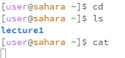
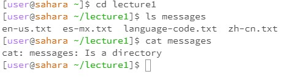
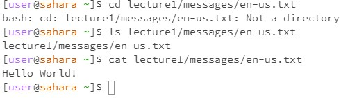

# Lab Report 1

Command: [user@sahara ~]$ cd

Explanation: This command moves the user to their home directory.

Output: No visible output.

Error: No.

Command: [user@sahara ~]$ ls

Explanation: Lists files and directories in the current directory.

Output: lecture1

Error: No. This output indicates that there's a directory named lecture1 in the current directory.

Command: [user@sahara ~]$ cat

Explanation: When cat is used without any arguments, it expects input from the user, usually terminated by Ctrl+D.

Output: No visible output.

Error: Not in this context since there's no indication that the user attempted to provide or terminate input.

Command: [user@sahara ~]$ cd lecture1

Explanation: This command moves the user into the lecture1 directory.

Output: No visible output.

Error: No.

Command: [user@sahara ~/lecture1]$ ls messages

Explanation: Lists the contents of the messages directory inside lecture1.

Output: en-us.txt es-mx.txt language-code.txt zh-cn.txt

Error: No. This shows that there are four files inside the messages directory.

Command: [user@sahara ~/lecture1]$ cat messages

Explanation: The user attempts to display the content of messages using cat.

Output: cat: messages: Is a directory

Error: Yes. The error arises because cat is used to display the content of files and not directories. The output indicates that messages is a directory and cannot be displayed using cat.

Command: [user@sahara ~]$ cd lecture1/messages/en-us.txt

Explanation: The user is trying to navigate to a file as if it were a directory.

Output: bash: cd: lecture1/messages/en-us.txt: Not a directory

Error: Yes. The error is because the cd command is for navigating directories, but en-us.txt is a file.

Command: [user@sahara ~]$ ls lecture1/messages/en-us.txt

Explanation: Lists the specified file.

Output: lecture1/messages/en-us.txt

Error: No. This confirms that the en-us.txt file exists in the given path.

Command: [user@sahara ~]$ cat lecture1/messages/en-us.txt

Explanation: This command displays the contents of the en-us.txt file.

Output: Hello World!

Error: No. The output is the actual content of the file.
